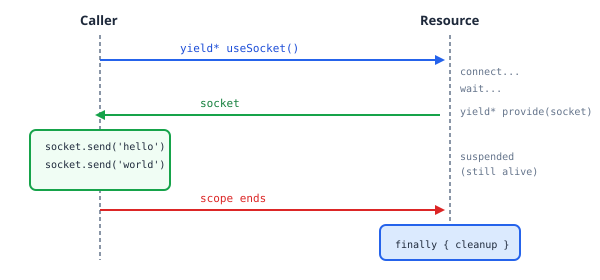

Actions are like vending machines: put in a request, get back a result, done. But what about things that need to **stay alive** while you interact with them?

- A WebSocket connection you send messages through
- An HTTP server that handles requests
- A database connection pool
- A file watcher

These aren't vending machines—they're more like rental cars. You need them to stick around while you use them, and they need to be returned (cleaned up) when you're done.

These are **resources**: long-running services with managed lifetimes.

## The Problem: Operations That Block

We want to create a `useSocket()` function that:

1. Creates and connects a socket
2. Returns the socket to the caller for use
3. Cleans up the socket when the scope ends

Let's try building this with what we know so far:

```typescript
import type { Operation } from "effection";
import { main, action, suspend } from "effection";
import { EventEmitter } from "events";

// Fake socket for demo
class FakeSocket extends EventEmitter {
  connect() {
    setTimeout(() => this.emit("connect"), 100);
  }
  send(msg: string) {
    console.log("Sending:", msg);
  }
  close() {
    console.log("Socket closed");
  }
}

function* useSocket(): Operation<FakeSocket> {
  const socket = new FakeSocket();
  socket.connect();

  // Wait for connection
  yield* action<void>((resolve) => {
    socket.once("connect", resolve);
    return () => {};
  });

  try {
    yield* suspend(); // Stay alive for cleanup...
    return socket;
  } finally {
    socket.close();
  }
}

await main(function* () {
  const socket = yield* useSocket();
  socket.send("hello");
});
```

**This code hangs forever!** The problem: `suspend()` keeps the operation alive (good for cleanup!) but blocks the return (bad for the caller!).

We can't win:

- **Return immediately?** The operation ends, `finally` runs, socket closes before we use it
- **Suspend to stay alive?** We never return the socket to the caller

We need a way to say: _"Here's the value — now keep me alive until you're done with it."_

## Enter `resource()`

The `resource()` function solves this with a special `provide()` operation:

```typescript
import type { Operation } from "effection";
import { main, resource, action, sleep } from "effection";
import { EventEmitter } from "events";

// Fake socket for demo
class FakeSocket extends EventEmitter {
  connect() {
    setTimeout(() => this.emit("connect"), 100);
  }
  send(msg: string) {
    console.log("Sending:", msg);
  }
  close() {
    console.log("Socket closed");
  }
}

function useSocket(): Operation<FakeSocket> {
  return resource<FakeSocket>(function* (provide) {
    const socket = new FakeSocket();
    socket.connect();

    // Wait for connection
    yield* action<void>((resolve) => {
      socket.once("connect", resolve);
      return () => {};
    });

    console.log("Socket connected!");

    try {
      // provide() gives the socket to the caller AND suspends
      yield* provide(socket);
    } finally {
      socket.close();
    }
  });
}

await main(function* () {
  const socket: FakeSocket = yield* useSocket();

  socket.send("hello");
  socket.send("world");

  yield* sleep(100);

  // When main ends, the resource cleans up
});
```

Output:

```
Socket connected!
Sending: hello
Sending: world
Socket closed
```

## How `provide()` Works

`yield* provide(socket)` breaks the normal pattern. The `yield*` sends the socket back to the caller, but the resource keeps running:



This is the key insight: **`yield* provide(value)` uses the yield to send a value back to the caller, while the resource keeps running in the background.** When the parent scope ends, the resource resumes from `provide()` and hits the `finally` block for cleanup.

## The Two Criteria for Resources

Use a resource when:

1. **The operation is long-running** - it needs to stay alive
2. **You need to interact with it** - call methods, send data, etc.

If you just need to do some async work and get a result, use a regular operation. If you need to set up something and keep it running, use a resource.

## Resources Can Use Resources

Resources compose naturally:

```typescript
import type { Operation } from "effection";
import { main, resource, spawn, sleep } from "effection";
import { EventEmitter } from "events";

// Fake socket
class FakeSocket extends EventEmitter {
  connect() {
    setTimeout(() => this.emit("connect"), 50);
  }
  send(msg: string) {
    console.log(">> Sending:", msg);
  }
  close() {
    console.log("Socket closed");
  }
}

function useSocket(): Operation<FakeSocket> {
  return resource<FakeSocket>(function* (provide) {
    const socket = new FakeSocket();
    socket.connect();

    yield* sleep(50); // Wait for connect

    try {
      yield* provide(socket);
    } finally {
      socket.close();
    }
  });
}

// A socket with automatic heartbeat
function useHeartbeatSocket(): Operation<FakeSocket> {
  return resource<FakeSocket>(function* (provide) {
    // Use another resource!
    const socket: FakeSocket = yield* useSocket();

    // Start heartbeat in background
    yield* spawn(function* (): Operation<void> {
      while (true) {
        yield* sleep(500);
        socket.send("heartbeat");
      }
    });

    // Provide the socket
    yield* provide(socket);

    // Cleanup: when this resource ends, the spawned heartbeat
    // is automatically halted (child of this resource)
  });
}

await main(function* () {
  const socket: FakeSocket = yield* useHeartbeatSocket();

  socket.send("hello");

  yield* sleep(1200); // Let some heartbeats happen

  socket.send("goodbye");

  // When main ends:
  // 1. useHeartbeatSocket's spawn is halted (heartbeat stops)
  // 2. useSocket's finally runs (socket.close())
});
```

Output:

```
>> Sending: hello
>> Sending: heartbeat
>> Sending: heartbeat
>> Sending: goodbye
Socket closed
```

## Practical Example: HTTP Server Resource

```typescript
import type { Operation } from "effection";
import { main, resource, ensure, suspend } from "effection";
import { createServer, Server, IncomingMessage, ServerResponse } from "http";

interface HttpServer {
  server: Server;
  port: number;
}

function useHttpServer(port: number): Operation<HttpServer> {
  return resource<HttpServer>(function* (provide) {
    const server = createServer((req: IncomingMessage, res: ServerResponse) => {
      res.writeHead(200, { "Content-Type": "text/plain" });
      res.end("Hello from Effection!\n");
    });

    // Start listening
    server.listen(port);
    console.log(`Server starting on port ${port}...`);

    // Ensure cleanup
    yield* ensure(() => {
      console.log("Closing server...");
      server.close();
    });

    // Provide the server to the caller
    yield* provide({ server, port });
  });
}

await main(function* () {
  const { port }: HttpServer = yield* useHttpServer(3000);

  console.log(`Server running at http://localhost:${port}`);
  console.log("Press Ctrl+C to stop\n");

  // Keep running until interrupted
  yield* suspend();
});
```

Run it and press Ctrl+C - you'll see "Closing server..." printed, proving cleanup ran!

## Using `ensure()` for Cleanup

Instead of try/finally, you can use `ensure()`:

```typescript
import type { Operation } from "effection";
import { main, resource, ensure, sleep } from "effection";

interface Connection {
  query: (sql: string) => string;
}

function useDatabase(): Operation<Connection> {
  return resource<Connection>(function* (provide) {
    console.log("Connecting to database...");
    yield* sleep(100); // Simulate connection time

    const connection: Connection = {
      query: (sql: string) => `Result of: ${sql}`,
    };

    // ensure() is cleaner than try/finally for simple cleanup
    yield* ensure(() => {
      console.log("Disconnecting from database...");
    });

    console.log("Database connected!");
    yield* provide(connection);
  });
}

await main(function* () {
  const db: Connection = yield* useDatabase();

  console.log(db.query("SELECT * FROM users"));

  yield* sleep(100);

  // cleanup runs when main ends
});
```

Output:

```
Connecting to database...
Database connected!
Result of: SELECT * FROM users
Disconnecting from database...
```

## Resources vs Actions vs Operations

| Use Case                              | Tool                |
| ------------------------------------- | ------------------- |
| One-time callback (setTimeout)        | `action()`          |
| Async computation                     | Regular `function*` |
| Long-running service with interaction | `resource()`        |
| Running concurrent child tasks        | `spawn()`           |

## Key Takeaways

Resources are rental cars, not vending machines:

1. **Resources are for long-running services** - things that need to stay alive while you use them
2. **`provide()` hands over the keys AND keeps the engine running** - caller uses it, resource stays alive
3. **Cleanup is guaranteed** - the car gets returned when the rental period (scope) ends
4. **Resources compose** - rent a car that comes with a GPS (resources using resources)
5. **Use `ensure()` for simple cleanup** - cleaner than try/finally for one-liners
