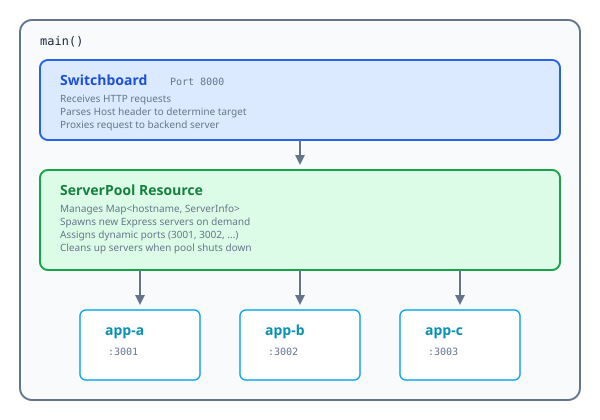

This capstone project builds a **Multiplex HTTP Proxy**—think of it as a telephone switchboard from the 1950s, but for HTTP. Requests come in, the operator (our code) figures out who they're for, spins up a connection if needed, and patches them through.

The twist: every connection, every server, every background task will be properly managed by Effection. Press Ctrl+C and watch the whole building power down gracefully—no orphaned processes, no leaked connections.

## What We're Building

## User Flow

1. User makes request to `http://localhost:8000` with `Host: app-a.localhost`
2. Switchboard receives request, extracts hostname `app-a`
3. ServerPool checks if `app-a` server exists
4. If not, spawns a new Express server on port 3001
5. Switchboard proxies request to `localhost:3001`
6. Response flows back to user
7. When main() ends (Ctrl+C), all servers are automatically cleaned up

## Components

### 1. Express Server Resource (`useExpressServer`)

A resource that:

- Creates an Express app
- Listens on a given port
- Provides the app and server to the caller
- Closes the server on cleanup

### 2. Server Pool Resource (`useServerPool`)

A resource that:

- Maintains a Map of hostname → server info
- Has a `getOrCreate(hostname)` method
- Spawns new servers as child tasks
- Uses Context to share itself with children

### 3. Switchboard Resource (`useSwitchboard`)

A resource that:

- Listens on the main port (8000)
- Uses `http-proxy` to forward requests
- Calls ServerPool to get/create backend servers
- Handles errors gracefully

## Effection Concepts Used

| Concept      | Usage                                     |
| ------------ | ----------------------------------------- |
| `main()`     | Entry point, handles Ctrl+C               |
| `resource()` | Express servers, server pool, switchboard |
| `spawn()`    | Creating new server tasks                 |
| `useScope()` | Running operations from Express handlers  |
| `Context`    | Sharing ServerPool with operations        |
| `ensure()`   | Cleanup of servers                        |
| `Channel`    | Logging events                            |
| `suspend()`  | Keeping the main process alive            |

## Next Steps

Let's build each component step by step:

1. [Server Resource](./server-resource.mdx) — wrapping Express as a resource
2. [Server Pool](./server-pool.mdx) — managing multiple servers dynamically
3. [Switchboard](./switchboard.mdx) — routing requests to backends
4. [Final Assembly](./final-assembly.mdx) — putting it all together
