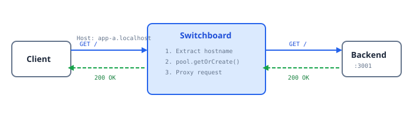

The Switchboard is the front door—it receives all incoming HTTP requests and proxies them to the appropriate backend server.

## What It Does



## The Resource

```typescript
import type { Operation } from "effection";
import { resource, call } from "effection";
import express, {
  type Express,
  type Request,
  type Response,
  type NextFunction,
} from "express";
import httpProxy from "http-proxy";
import type { Server } from "http";
import type { SwitchboardConfig, ServerPool } from "./types";

export interface SwitchboardHandle {
  app: Express;
  server: Server;
  port: number;
}

export function useSwitchboard(
  config: SwitchboardConfig,
  pool: ServerPool,
): Operation<SwitchboardHandle> {
  return resource<SwitchboardHandle>(function* (provide) {
    const { port, defaultHostname = "default" } = config;

    const app: Express = express();

    // Create the proxy
    const proxy = httpProxy.createProxyServer({
      changeOrigin: false,
      ws: true, // WebSocket support
    });

    // ... routes and handlers ...

    // Start listening
    const server: Server = yield* call(
      () =>
        new Promise<Server>((resolve, reject) => {
          const srv = app.listen(port, () => {
            console.log(`[Switchboard] Listening on port ${port}`);
            resolve(srv);
          });
          srv.on("error", reject);
        }),
    );

    try {
      yield* provide({ app, server, port });
    } finally {
      proxy.close();
      server.close();
      yield* call(
        () =>
          new Promise<void>((resolve) => {
            server.on("close", resolve);
          }),
      );
    }
  });
}
```

## Extracting the Hostname

We need to figure out which backend to route to. Multiple options:

```typescript
function extractHostname(req: Request, defaultHostname: string): string {
  const host = req.get("host") || "";
  const hostWithoutPort = host.split(":")[0] ?? "";

  // Handle "app-a.localhost" -> "app-a"
  if (hostWithoutPort.includes(".")) {
    const parts = hostWithoutPort.split(".");
    return parts[0] ?? defaultHostname;
  }

  // Check for X-App-Name header as alternative
  const appHeader = req.get("x-app-name");
  if (appHeader) {
    return appHeader;
  }

  return defaultHostname;
}
```

This supports:

- `app-a.localhost:8000` → `app-a`
- `myapp.localhost` → `myapp`
- Header `X-App-Name: custom` → `custom`
- Plain `localhost` → `default`

## The Proxy Handler

The main handler uses the pool to get/create servers:

```typescript
app.use(async (req: Request, res: Response, next: NextFunction) => {
  try {
    const hostname = extractHostname(req, defaultHostname);

    console.log(`[Switchboard] Request for hostname: "${hostname}"`);

    // Get or create the backend server
    const serverInfo = await pool.getOrCreate(hostname);

    // Proxy to the backend
    const target = `http://localhost:${serverInfo.port}`;

    proxy.web(req, res, { target }, (err) => {
      if (err) {
        console.error(`[Switchboard] Proxy failed:`, err.message);
        if (!res.headersSent) {
          res.status(502).json({
            error: "Bad Gateway",
            message: `Failed to proxy to ${hostname}: ${err.message}`,
          });
        }
      }
    });
  } catch (error) {
    next(error);
  }
});
```

Notice:

- `pool.getOrCreate()` is Promise-based, so we can `await` it directly
- The server is created on-demand if it doesn't exist
- Proxy errors return 502 Bad Gateway

## Admin Endpoints

Useful for debugging:

```typescript
// Health check for the switchboard itself
app.get("/__switchboard/health", (_req: Request, res: Response) => {
  res.json({
    status: "ok",
    servers: pool.list().map((s) => ({
      hostname: s.hostname,
      port: s.port,
      uptime: Date.now() - s.startedAt.getTime(),
    })),
  });
});

// List all running servers
app.get("/__switchboard/servers", (_req: Request, res: Response) => {
  res.json({
    servers: pool.list().map((s) => ({
      hostname: s.hostname,
      port: s.port,
      startedAt: s.startedAt.toISOString(),
    })),
  });
});
```

## Error Handling

Handle proxy errors gracefully:

```typescript
proxy.on("error", (err, _req, res) => {
  console.error(`[Switchboard] Proxy error:`, err.message);
  if (res && "writeHead" in res && !res.headersSent) {
    (res as Response).status(502).json({
      error: "Bad Gateway",
      message: err.message,
    });
  }
});

// Express error handler
app.use((err: Error, _req: Request, res: Response, _next: NextFunction) => {
  console.error(`[Switchboard] Unhandled error:`, err);
  if (!res.headersSent) {
    res.status(500).json({
      error: "Internal Server Error",
      message: err.message,
    });
  }
});
```

## WebSocket Support

The proxy also handles WebSocket upgrades:

```typescript
server.on("upgrade", async (req, socket, head) => {
  try {
    const hostname = extractHostname(
      req as unknown as Request,
      defaultHostname,
    );
    const serverInfo = await pool.getOrCreate(hostname);
    const target = `http://localhost:${serverInfo.port}`;

    proxy.ws(req, socket, head, { target });
  } catch (error) {
    console.error(`[Switchboard] WebSocket upgrade failed:`, error);
    socket.destroy();
  }
});
```

## Key Takeaways

1. **http-proxy for proxying** — handles the HTTP proxying details
2. **Pool's Promise API** — easy to use from Express handlers with `await`
3. **Hostname extraction** — flexible routing based on Host header or custom header
4. **Admin endpoints** — helpful for debugging and monitoring
5. **Graceful error handling** — return proper HTTP errors, don't crash

## Next Up

Time to put it all together! Let's see the [Final Assembly](./final-assembly.mdx).
